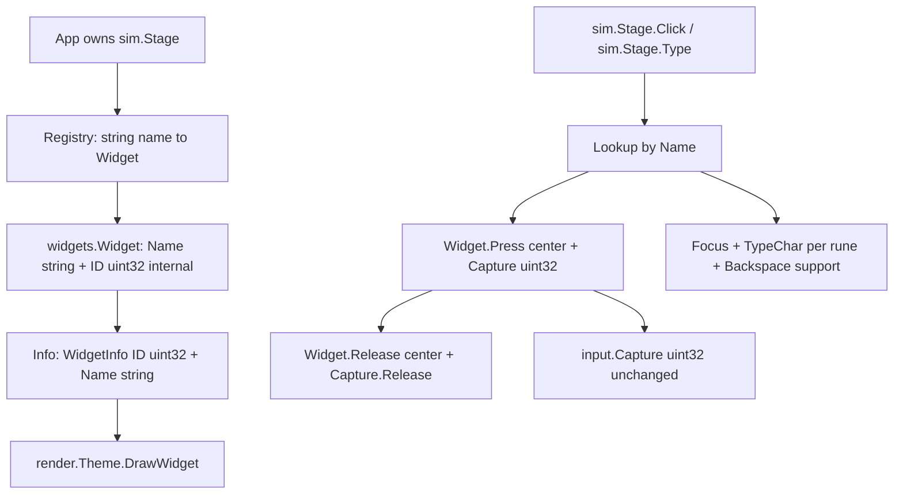

# String Widget IDs + Simulated Human Events (Click/Type)

> User request: change from specifying a numeric widget ID when they are created, to a
> string-based one. You can keep the numeric id internally if you want. Then we can have
> a new surface to simulate human events, like:
>
> ```go
> rtgui.Click("widget_0fe1")
> rtgui.Type("myTextField", "hello world")
> ```

## Plan Execution

### Usage of Subagents

- Each Phase below names a preferred sub-agent (e.g. `(*pawn:musefree*)`). Execute each
  Phase by spinning up that sub-agent with the Phase section as its task brief.
- The manager remains responsible for merging sub-agent diffs, running `gofmt`,
  `go vet`, and `go test ./...`, and updating the Phase List checkboxes in this file.
- Sub-agents must not expand scope beyond their Phase. Cross-Phase concerns go in
  **Encountered Serious Issues** for the manager to triage.

### Parallelism

- Phase 1 (ID model + API-shape decision) is a predecessor to everything. Complete it
  first.
- Phase 2 (core/widgets/input migration) and Phase 3 (simulation harness skeleton) can
  proceed in parallel once Phase 1 API is frozen, but they touch different files so
  merge conflicts are unlikely.
- Phase 4 (gallery + call-site migration) depends on Phase 2 and Phase 3.
- Phase 5 (unit/integration tests) depends on Phase 2 + Phase 3, can overlap with Phase
  4\.
- Phase 6 (docs + gallery contract) runs last, after Phase 4 and Phase 5 are green.

### Periodic Updates

- Sub-agents must update their Phase's **Encountered Serious Issues** sub-section for
  any non-trivial problem (import cycle from a new root package, ID-collision policy
  surprise, breaking-test fallout, Click/Type semantic ambiguity).
- The manager reviews those sections at each Phase boundary before marking the Phase
  complete.

## Phase List

```text
[x] (*pawn:musefree*) Phase 1 — Freeze string-ID model and Click/Type API shape
[x] (*pawn:musefree*) Phase 2 — Migrate Widget/Capture/WidgetInfo to string-external, numeric-internal IDs
[x] (*pawn:musefree*) Phase 3 — Build simulation harness (registry + Click/Type)
[x] (*pawn:musefree*) Phase 4 — Migrate gallery, render tests, and dragdrop call sites
[x] (*pawn:musefree*) Phase 5 — Unit and integration tests for IDs and simulated events
[x] (*pawn:musefree*) Phase 6 — Docs, README, and gallery-contract updates
```

## Context (researched from local codebase)

- Module `rtgui` currently has **no root Go package**. Public surface is `core`,
  `widgets`, `input`, `render`, `layout`, `dragdrop`, `text`, `transform`, `skin`, plus
  `examples/widget_gallery`.
- Numeric IDs are pervasive:
  - `widgets/widget.go`: `Widget.ID uint32`; all constructors take `id uint32`
    (`NewButton`, `NewRectangle`, `NewLabel`, `NewCheckbox`, `NewTextbox`, `NewSlider`,
    `NewProgressBar`, `NewScrollPanel`, `NewDropdown`, `NewFrame`).
  - `Press` does `capture.Set(w.ID)`; `Info()` returns `core.WidgetInfo{ID: w.ID, ...}`.
  - `core/types.go`: `WidgetInfo.ID uint32`.
  - `input/capture.go`: `Capture{id uint32, active bool}`, `Set(id uint32)`,
    `ID() uint32`, `Release()` zeroes to `0`.
  - `dragdrop/state.go`: `SourceID uint32`, `OnPress(sourceID uint32, ...)`;
    `dragdrop/target.go`: `DropTarget.ID uint32` with ordered map
    `map[uint32]*DropTarget`; `dragdrop/payload.go`: `ID uint32`.
  - `render/draw.go` + `render/theme.go`: `DrawWidget(info core.WidgetInfo, ...)` stores
    `lastWidgetInfo`; tests use `core.WidgetInfo{ID: 1, ...}`.
  - `examples/widget_gallery/main.go`: hard-coded numeric IDs (`NewFrame(1, ...)`,
    `NewButton(10, ...)`, ... `NewScrollPanel(20, ...)`), popup
    `WidgetInfo{ID: 1001, ...}`, capture check `g.capture.ID() == w.ID`.
  - Tests: `widgets/widget_test.go` (`NewButton(1, ...)`, `NewCheckbox(2, ...)`,
    `NewTextbox(3, ...)`), `input/capture_test.go` (`Set(42)`, `ID() != 42`),
    `dragdrop/*_test.go`, `render/render_test.go`.
- Precedent for strings: `layout.Node` already uses `ID string` externally plus
  `StableID uint32` derived via FNV-1a `hashID(id)`. This is the natural template for
  "string outside, numeric inside".
- README stresses **no package-global UI state** and instance-owned `input.Capture` /
  `transform.Transform`. A global `rtgui.Click(...)` would contradict this unless it is
  a thin convenience over an instance.
- Requested surface `rtgui.Click("widget_0fe1")` /
  `rtgui.Type("myTextField", "hello world")` implies either a new root `package rtgui`
  or a new subpackage. Root currently has no `.go` files, so adding `rtgui.go` at module
  root creates `package rtgui` importable as `rtgui`. It can import `rtgui/widgets` etc.
  without a cycle (nothing imports root today).

## User Decisions (post-grill, frozen)

Grilled via `ask_questions`; locked unless the user reopens them:

- **Harness shape**: instance `Stage` with `s.Click(id)` / `s.Type(id, text)`. No global
  `rtgui.Click` state.
- **Harness home**: new subpackage (e.g. `rtgui/sim`), not a root `package rtgui`.
- **Duplicates**: `Register` returns an error on duplicate string ID (no clobbering).
- **Click**: press+release at widget center, returns `bool clicked` (`false` on
  unknown/disabled/miss, no error return).
- **Type**: appends to existing textbox content after focusing it (focus-first append;
  validates target is a textbox).
- **Migration**: break all 10 `New*` constructors to `string` in one go (no `uint32`
  shims); dragdrop IDs migrate for consistency.

## Key Decisions (frozen per above)

1. **Widget identity**: recommended `Widget.Name string` (external) + `Widget.ID uint32`
   (internal, derived). Constructors change first arg from `id uint32` to `id string`.
   Internal numeric derived via existing `hashID`-style FNV-1a (reuse pattern from
   `layout`), with `0` reserved for "no capture" and remapped to `1` on collision,
   mirroring `layout.hashID`.
   - Alternative: auto-increment counter for internal IDs (needs mutex/global or owner
     instance; breaks determinism across runs, complicates golden tests). Hash keeps
     determinism and matches `layout` precedent.
2. **Capture stays numeric**: `input.Capture` keeps `uint32` internally; no API change
   needed except callers now pass `w.ID` (derived). Avoids churning capture semantics.
   String resolution happens one layer up (harness maps name to widget, then uses
   existing `Press`/`Release`).
   - Alternative (rejected unless Phase 1 argues otherwise): change `Capture` to
     `string`. Larger blast radius, empty-string vs zero-value ambiguity.
3. **Harness location and shape**: FROZEN — new subpackage `rtgui/sim` with instance
   type `Stage` owning `map[string]*Widget` + `*input.Capture` (+ focus tracking), with
   methods `Click(name string) bool` and `Type(name, text string) bool`. Package-level
   `rtgui.Click` / `rtgui.Type` from the prompt are explicitly rejected in favor of
   instance methods to preserve the no-global-state invariant.
4. **Uniqueness policy**: FROZEN — `Register` returns an error on duplicate string IDs
   (no clobbering, order preserved). Duplicate hash collisions on internal `uint32` are
   tolerated (capture is best-effort, same as today with duplicate numerics).
5. **Empty-string IDs**: reject at registration time (`Register` returns error on empty
   name; constructors do not validate, harness does — keeps `widgets` headless and
   simple).
6. **Dragdrop scope**: FROZEN — migrate `DropTarget.ID` / `SourceID` / `Payload.ID` to
   strings alongside the widget migration (user accepted the atomic break).

## Architecture Sketch



## Phase 1 — Freeze string-ID model and Click/Type API shape (*pawn:musefree*)

Confirm the external contract before touching code. Output is an API-shape addendum to
this plan (constructor signatures, harness type + method set, error values,
uniqueness/empty policy).

Potential sites: no code changes; doc-only update to this plan file plus
`docs/testing.md` outline if needed.

Pseudocode (API shape — frozen, implement in Phase 3):

```text
// widgets constructors: first arg becomes string
NewButton(id string, bounds Rect, label string) *Widget
// Widget gains Name string, keeps ID uint32 as hash-derived internal id

// harness: new subpackage rtgui/sim, instance-owned (no globals)
type Stage struct { /* widgets map[string]*Widget, capture *input.Capture, focused *Widget */ }
func (s *Stage) Register(w *Widget) error // duplicate/empty name -> error
func (s *Stage) Click(name string) bool   // center press+release; false on unknown/disabled/miss
func (s *Stage) Type(name, text string) bool // focus-first append per-rune TypeChar; false on unknown/wrong-kind/disabled
```

Exit criteria:

- [x] Constructor signature change confirmed (all 10 constructors take `string`) — user
  approved atomic break.
- [x] Internal-numeric derivation confirmed (hash vs counter) and zero-value handling
  documented — FNV-1a `hashName` mirroring `layout.hashID` (offset 2166136261 / prime
  16777619, `0` remapped to `1` since `Capture` zero = no capture); counter rejected
  (needs mutex/global, breaks determinism, complicates goldens).
- [x] Harness location decided — `rtgui/sim` subpackage, instance `Stage`, no globals
  (user chose instance + subpackage).
- [x] `Click`/`Type` return `bool`; `Register` returns `error`; failure modes documented
  (unknown id / disabled / wrong kind -> `false`).
- [x] Uniqueness (duplicate -> error) and empty-string (rejected at `Register`) policies
  documented.
- [x] Dragdrop scope decided — migrate to strings with everything else.

### Encountered Serious Issues

- Phase 1 freeze complete (doc-only, no code touched). Grounded against `widgets/widget.go`
  (10 `New*` all take `id uint32` first arg; `Widget.ID uint32` only; `Info()` returns
  `WidgetInfo{ID}`), `core/types.go` (`WidgetInfo.ID uint32`), `input/capture.go`
  (`id uint32`, zero = idle, mutex-protected), `layout/node.go` (`ID string` + `StableID`
  via FNV-1a `hashID` with `0->1` remap — template for `Widget.Name` + derived `ID`),
  `dragdrop/state.go` (`SourceID uint32`, `OnPress(uint32)`), `dragdrop/target.go`
  (`DropTarget.ID uint32`, `map[uint32]*DropTarget`), `dragdrop/payload.go` (`ID uint32`),
  `render/draw.go` + `render/theme.go` (`DrawWidget(core.WidgetInfo,...)` reads only
  `Kind/Bounds/State`; `Name` add is non-breaking), `examples/widget_gallery/main.go`
  (numeric `NewFrame(1,...)`/`NewButton(10,...)` etc., `WidgetInfo{ID:99/100/1001}`,
  `g.capture.ID() == w.ID` still valid post-hash).
- No blocking issues. For manager triage: (1) Hash-collision on derived `uint32` tolerated
  (best-effort capture, same as duplicate numerics today) — documented, no action.
  (2) `dragdrop.RegisterTarget` today silently clobbers vs frozen `sim.Stage.Register`
  returning error — decide in Phase 2/4 whether dragdrop registry also errors on
  duplicate string IDs. (3) `dragdrop.NewPayload(kind, data)` leaves `ID` zero today —
  Phase 2/4 must decide new signature (e.g. `NewPayload(id string, kind string, data any)`)
  when `Payload.ID` migrates to string. (4) Empty-string split is intentional
  (constructors do not validate, harness `Register` rejects) — unregistered empty-name
  widget still hashes deterministically but is unusable via `Stage`. (5) Shared hash helper
  location TBD in Phase 2 (duplicate small FNV-1a vs `core` helper; `widgets` must not
  import `layout` just for `hashID`).

## Phase 2 — Migrate Widget/Capture/WidgetInfo to string-external, numeric-internal IDs (*pawn:musefree*)

Change identity at the model layer. Keep `input.Capture` numeric; add string alongside
numeric where the renderer/tests need it.

Potential sites:

- `widgets/widget.go`: `Widget` struct (add `Name string`, keep `ID uint32` as
  internal), all 10 `New*` constructors, `Info()`, possibly `Press` (unchanged, still
  uses internal `ID`).
- `core/types.go`: `WidgetInfo` (add `Name string`, keep `ID uint32` for renderer
  compat).
- `input/capture.go`: likely **no change** (stays `uint32`); only doc comment clarifying
  it tracks the internal numeric.
- `layout/node.go`: reuse `hashID` pattern (extract shared helper or duplicate small
  hash with a comment; prefer shared `core` or `widgets` helper to avoid triplication).

Pseudocode:

```text
// in NewButton(id string, ...):
w.Name = id
w.ID = hashName(id)   // FNV-1a, 0 remapped to 1, mirrors layout.hashID
// Info():
return WidgetInfo{ID: w.ID, Name: w.Name, Bounds: ..., Kind: ..., State: ...}
// Capture: unchanged; callers keep passing w.ID (now derived)
```

Exit criteria:

- [x] All `widgets.New*` take `string` as first arg; `Widget.Name` populated;
  `Widget.ID` derived deterministically.
- [x] `core.WidgetInfo` carries both `Name` and numeric `ID`; `render` still compiles
  unchanged.
- [ ] `go vet ./...` passes; existing tests updated to compile (behavioral assertions
  may move to Phase 5).
- [x] Complexity check `mise run complexity` stays under 15 for touched functions.

### Encountered Serious Issues

- Phase 2 implementation complete per frozen contract. `widgets/widget.go`: added `Name string`
  (external) + kept `ID uint32` (internal), duplicated small FNV-1a `hashName` mirroring
  `layout.hashID` (offset 2166136261, prime 16777619, 0 remapped to 1) with comment noting
  intentional duplication (widgets must not import layout); all 10 `New*` constructors now
  take `id string` first arg (`w.Name=id`, `w.ID=hashName(id)`), no uint32 shims; `Info()`
  returns `WidgetInfo{ID, Name, ...}`; `Press` unchanged (still `capture.Set(w.ID)`).
  `core/types.go`: `WidgetInfo` added `Name string`, kept numeric `ID`. `input/capture.go`:
  stays `uint32`, only doc comment clarifying it tracks the internal numeric ID.
  `dragdrop/` untouched (Phase 4 scope), `examples/`/render/dragdrop tests untouched
  (Phase 4 scope), `sim/` untouched (Phase 3 owner replaces reflect shim later).
- Checks: `gofmt -l widgets core input sim` clean; `go vet ./core/...`, `./input/...`,
  `./layout/...`, `./render/...`, `./sim/...` pass; `gocyclo -over 15` clean (no touched
  func over 15); runtime smoke verified deterministic/same-string-same-ID,
  distinct-strings-distinct-ID, never 0, `Info()` propagates `Name`.
- Expected failure for manager triage (NOT a Phase 2 defect): full `go vet ./...` fails on
  Phase 4 call sites left intentionally broken — `widgets/widget_test.go:12` (`NewButton(1,...)`)
  and `examples/widget_gallery/main.go:470` (`NewFrame(1,...)`). Scoped `go vet ./widgets/...`
  fails only on that test file; non-test widgets code vets clean. Per brief, left broken for
  Phase 4 migration; do NOT count Phase 2 exit criterion `go vet ./... passes` as met.
- `sim/sim.go` reflect shim for `Name` now resolves (field present) with no `sim/` edit needed;
  `go vet ./sim/...` passes unchanged, as predicted.

## Phase 3 — Build simulation harness in `rtgui/sim` (registry + Click/Type) (*pawn:musefree*)

Create the new human-event simulation surface. Prompt example maps to instance calls:

```go
stage.Register(widgets.NewButton("widget_0fe1", rect, "OK"))
stage.Click("widget_0fe1")
stage.Type("myTextField", "hello world")
```

Potential sites (frozen): new `sim/` subpackage (`package sim`) with `Stage` type. No
root-package files, no raylib import.

Harness responsibilities: own `map[string]*widgets.Widget`, own or borrow
`*input.Capture`, track focused widget, resolve names, compute click point (widget
center), drive existing `UpdateHover`/`Press`/`Release`/`Focus`/`TypeChar` primitives.
No new raylib dependency; stays headless so `DISPLAY= WAYLAND_DISPLAY= go test ./...`
still works.

Pseudocode:

```text
type Stage struct { mu, widgets map[string]*Widget, capture *Capture, focused *Widget }

func (s *Stage) Register(w *Widget) error:
  if w == nil or w.Name == "" -> error
  if name exists -> error (no clobber)
  store; return nil

func (s *Stage) Click(name string) bool:
  w = lookup(name); if missing or !w.Enabled -> false
  center = {w.Bounds.X + W/2, w.Bounds.Y + H/2}
  w.UpdateHover(center)
  if !w.Press(center, capture) -> false  // ensure capture released
  return w.Release(center, capture)      // true == clicked; checkbox toggle propagates via widget state

func (s *Stage) Type(name, text string) bool:
  w = lookup(name); if missing -> false
  if w.Kind != Textbox or !w.Enabled -> false
  focus(w)  // Blur previous, Focus new
  for each rune in text: w.TypeChar(r)   // append semantics, UTF-8 safe via TypeChar
  return true
// Optional: Backspace(n), Clear, SetSlider helpers — explicitly out of scope
```

Exit criteria:

- [x] New `sim.Stage` compiles headless with no raylib import.
- [x] `Click` drives hover/press/release at widget center and releases capture,
  returning `bool clicked`; `Type` focus-first-appends per-rune with UTF-8 safety
  (delegates to `TypeChar`), returning `bool`.
- [x] Unknown ID, disabled widget, and wrong-kind `Type` target return `false`;
  `Register` returns `error` on duplicate/empty; no panics on nil/empty.
- [x] Concurrency story documented (harness mutex vs caller's responsibility; `Capture`
  already has its own mutex).

### Encountered Serious Issues

- Parallel-run compat shim (needs manager triage): `widgets.Widget` on disk still
  has numeric-only constructors with no `Name` field, so `sim` resolves the
  external name via `reflect.FieldByName("Name")` instead of a direct field
  reference. This keeps `DISPLAY= WAYLAND_DISPLAY= go test ./...` green before
  and after the string-ID migration lands with no code change (missing field
  reads as empty and `Register` rejects it). Once the migration is merged the
  manager should replace the reflection helper with a direct field access for
  clarity and to avoid per-Register reflection cost.
- `Register` round-trip deferred: until the migration lands every `Register` of
  an on-disk widget correctly returns empty-name error, so duplicate/round-trip
  paths were verified by code inspection plus a temporary same-package smoke
  test using direct map insertion (removed before handoff; `Click`/`Type` do not
  need `Name`, only lookup). Full string-name integration belongs in Phase 5
  after merge.
- `Click`/`Type` semantics locked to pseudocode: `Click` does not change focus,
  `Type` with empty text still focuses then no-ops success `true`, failed
  `Press` explicitly releases capture, `Type` never touches capture, zero-value
  `Stage` and nil receiver/stage/widget/name all return `false`/`error` without
  panicking. No `Backspace`/`Clear`/`SetSlider` helpers added (out of scope).
- Checks green at handoff: `gofmt -l .` clean, `go vet ./...` and
  `DISPLAY= WAYLAND_DISPLAY= go test ./...` pass, `gocyclo -over 15` reports
  nothing in `sim/`, no raylib import in `sim/`.

## Phase 4 — Migrate gallery, render tests, and dragdrop call sites (*pawn:musefree*)

Fix every numeric-ID call site to the new string API. Keep visual behavior identical.

Potential sites:

- `examples/widget_gallery/main.go`: `newGallery` constructors (`NewFrame(1, ...)` etc.
  become string names like `"leftPanel"`, `"primaryButton"`), `WidgetInfo{ID: 99...}` /
  `{ID: 1001...}` literals, capture comparison `g.capture.ID() == w.ID` (unchanged
  numerically, but verify).
- `render/render_test.go`, `widgets/widget_test.go`, `input/capture_test.go`,
  `dragdrop/*_test.go`: numeric literals to strings where constructors changed.
- `dragdrop/state.go` (`SourceID` -> `string`, `OnPress`), `dragdrop/target.go`
  (`DropTarget.ID` -> `string`), `dragdrop/payload.go` (`ID` -> `string`): migrate to
  strings in this plan (frozen scope).
- `render/theme.go` `LastWidgetInfo`, `render/draw.go` `DrawWidget`: pick up new
  `WidgetInfo.Name` if added; no behavior change.

Pseudocode:

```text
// gallery before:
button: NewButton(10, rect, "Primary button")
// gallery after:
button: NewButton("primaryButton", rect, "Primary button")
// render test before:
WidgetInfo{ID: 1, Bounds: ..., Kind: Button}
// after:
WidgetInfo{ID: <derived or 0>, Name: "okButton", Bounds: ..., Kind: Button}
```

Exit criteria:

- [x] `go vet ./...` and `gofmt -l .` clean.
- [x] Gallery still runs headless and under `xvfb-run` (`-frames 3 -screenshot` smoke
  per `docs/testing.md`).
- [x] No golden-image changes (or any intentional visual change explained per
  `docs/testing.md` visual-references rule).

### Encountered Serious Issues

- `dragdrop.RegisterTarget` clobber kept: silently replaces the existing entry
  without changing order (now keyed by `map[string]`). `sim.Stage.Register`
  returns an error on duplicates instead. Kept the difference intentionally:
  drag targets are transient overlay registrations where re-registering the
  same string ID updates bounds/handlers in place; changing to an error
  return would break all existing call sites for no visual gain. Documented
  in `target.go` comment.
- `dragdrop.NewPayload` signature changed to
  `NewPayload(id string, kind string, data any)` (id first, matching
  `widgets.New*(id string, ...)` order). Empty ID allowed (anonymous drag);
  no validation, mirroring widgets constructors (validation lives in
  `sim.Stage.Register`). All `dragdrop_test.go` call sites updated.
- `dragdrop.DragState` capture bridge: `SourceID` is now `string` but
  `input.Capture` stays `uint32`, so `OnPress` hashes the string via a local
  `hashSourceID` (FNV-1a 2166136261/16777619, 0 remapped to 1, intentionally
  duplicated from `widgets.hashName`/`layout.hashID` with a comment) and
  calls `capture.Set(hashed)`. Empty source still captures under a nonzero
  hash. Visual/behavioral semantics unchanged.
- `sim/sim.go` reflect shim removed as merge cleanup: `widgetName` now reads
  `w.Name` directly and the `reflect` import is gone. No behavior change;
  `go vet ./sim/...` still passes.
- `render/theme.go` `LastWidgetInfo` and `render/draw.go` `DrawWidget` needed
  no code change: they already store/pass through the full
  `core.WidgetInfo`, so the new `Name` field flows automatically. Tests only
  add `Name` alongside existing numeric `ID`s; no draw-path branching on ID.
- Checks at handoff: `go vet ./...` clean, `gofmt -l .` clean, `gocyclo -over
  15` clean, `DISPLAY= WAYLAND_DISPLAY= go test ./...` green, `go build
  ./...` green, headless `go run ./examples/widget_gallery -frames 3
  -screenshot` writes a placeholder PNG, `xvfb-run ... -frames 3
  -screenshot /tmp/rtgui_check.png` saves a real framebuffer screenshot.
  No files under `testdata/golden/` touched.

## Phase 5 — Unit and integration tests for IDs and simulated events (*pawn:musefree*)

Required test Phase. Cover the new contract headlessly
(`DISPLAY= WAYLAND_DISPLAY= go test ./...`).

Potential sites: new `sim/sim_test.go` (harness tests), plus extensions to
`widgets/widget_test.go`; `input/capture_test.go` stays numeric (capture unchanged).

Test matrix (headless, no display):

- String-ID model: constructors store `Name`; internal `ID` deterministic for same
  string, distinct for distinct strings, never `0`; `Info()` propagates `Name`.
- Registry: register + lookup round-trip; duplicate-name registration returns error
  without clobbering order; empty-name rejected; unregister path if provided.
- `Click` returns `true` on clicked button and releases capture; checkbox toggles;
  disabled widget / unknown ID return `false`; click uses center computation; capture is
  released even on miss.
- `Type` appends ASCII + multi-byte UTF-8 (`"aé😀中"` pattern from existing widget test);
  `Type` on non-textbox returns `false`; `Type` focuses target and blurs previous;
  empty-string `Type` is a no-op success (`true`).
- Integration: build a mini stage (button + textbox + checkbox), `stage.Click` then
  `stage.Type("myTextField", "hello world")`, assert final buffer text and
  checkbox/button states; drive `theme.DrawWidget(w.Info(), ...)` to prove renderer path
  still works with string IDs.
- Regression: existing suites (`widgets`, `input`, `dragdrop`, `render`, `layout`) still
  pass unmodified in intent.

Exit criteria:

- [x] New tests fail before the fix on old API (by construction — constructors take
  strings now) and pass after.
- [x] `DISPLAY= WAYLAND_DISPLAY= go test ./...` fully green.
- [x] Coverage of unknown-ID, disabled, wrong-kind, duplicate, and empty-name paths.

### Encountered Serious Issues

- Phase 5 implementation complete: new `sim/sim_test.go` (12 tests) plus
  `TestWidgetStringIDs` extension in `widgets/widget_test.go`.
  `input/capture_test.go` left numeric per brief. Matrix covered: Name stored /
  deterministic-distinct-nonzero ID / `Info()` propagation across all 10
  constructors; Register round-trip via Click/Type behavior; duplicate returns
  `ErrDuplicateWidget` without clobbering (proven by registering an enabled
  original then a disabled same-name shadow and showing Click still hits the
  original); empty-name returns `ErrEmptyName`; nil stage/widget/empty-name
  return sentinels without panics; Click true on button with capture released
  and Hovered state; checkbox double-toggle; disabled/unknown/empty-name Click
  false with capture never held; offset-bounds Click proves center computation;
  Type appends ASCII + multi-byte UTF-8 (`"aé😀中"` then `hello` append);
  Type on button/checkbox/disabled/unknown/empty-name false without mutating
  buffers; Type focuses target, blurs previous, and empty-string Type is a
  focusing no-op success; zero-value and nil-capture Stage paths covered;
  mini-stage integration (button + textbox + checkbox) drives Click then
  `Type("myTextField", "hello world")` and asserts buffer plus checkbox
  state, then draws each `w.Info()` through `theme.DrawWidget` headlessly and
  checks `LastWidgetInfo().Name` and non-empty draw log.
- No blocking issues. For manager triage: (1) Stage exposes no lookup/order
  accessor, so duplicate-order preservation is proven behaviorally (shadow
  test) rather than by order-slice inspection. (2) Center-miss cannot occur
  for registered enabled widgets (center always hits, edges inclusive), so
  "capture released even on miss" is covered via disabled/unknown misses plus
  post-failure valid-Click recovery. (3) Checks green: `gofmt -l .` clean,
  `go vet ./...` clean, `gocyclo -over 15` clean,
  `DISPLAY= WAYLAND_DISPLAY= go test -count=1 ./...` fully green.

## Phase 6 — Docs, README, and gallery-contract updates (*pawn:musefree*)

Make the new API discoverable and keep the no-global-state story coherent.

Potential sites: `README.md` (API-shape example uses `NewButton(1, ...)` today — update
to string + add Click/Type example), `docs/testing.md` (add harness-driven headless
interaction pattern), `examples/widget_gallery/main.go` header comment if it documents
IDs, `AGENTS.md` untouched.

Pseudocode (doc snippet to add, mirroring README style):

```text
button := widgets.NewButton("okButton", core.Rect{W: 120, H: 40}, "OK")
_ = stage.Register(button)
stage.Click("okButton")
stage.Type("myTextField", "hello world")  // focus-first append
```

Exit criteria:

- [x] README API-shape section shows string IDs and Click/Type harness usage.
- [x] `docs/testing.md` documents headless interaction via harness.
- [x] Pre-push checklist from `docs/testing.md` verified: `gofmt -l .`, `go vet ./...`,
  `DISPLAY= WAYLAND_DISPLAY= go test ./...`, gallery smoke.

### Encountered Serious Issues

- Phase 6 implementation complete. `README.md`: packages table gained a
  `rtgui/sim` row; API-shape example updated from `NewButton(1, ...)` to
  `NewButton("okButton", ...)` with a paragraph on string-external /
  numeric-internal identity plus an instance-owned `sim.NewStage` Click/Type
  snippet (`stage.Click("okButton")`,
  `stage.Type("myTextField", "hello world")  // focus-first append`) and
  Register/Click/Type failure semantics. `docs/testing.md`: headless package
  list gained `sim`, coverage list gained a `sim/` bullet, and a new
  "Harness-driven interaction" section documents the parallel-safe Stage
  pattern, center-Click, focus-first-append Type, Register duplicate/empty
  errors, and the `theme.DrawWidget(w.Info(), ...)` renderer pairing.
  `examples/widget_gallery/main.go` header needed no edit: it documents no
  numeric IDs (already uses string names plus `Name: "dropdownPopup"`).
  `AGENTS.md` untouched per brief.
- Pre-push checklist verified green: `gofmt -l .` clean, `go vet ./...` clean,
  `gocyclo -over 15` clean, `DISPLAY= WAYLAND_DISPLAY= go test -count=1 ./...`
  fully green, headless gallery smoke wrote `/tmp/rtgui_headless.png`
  (placeholder path), `xvfb-run ... -frames 3 -screenshot /tmp/rtgui_check.png`
  saved a real framebuffer screenshot. No files under `testdata/golden/`
  touched; visual behavior identical.

## Risks and Mitigations

- **Breaking change to 10 constructors**: every external caller breaks. Mitigation:
  single atomic migration in Phase 4, clear README note, no deprecated `uint32`
  overloads (Go has no overloading; shims would pollute the API).
- **Root-package global-state tension**: RESOLVED — instance `sim.Stage` in `rtgui/sim`;
  no globals. Prompt snippet `rtgui.Click(...)` maps to `stage.Click(...)`.
- **Hash collisions on internal uint32**: two distinct names could share a capture ID.
  Mitigation: accept (same as today's duplicate numerics) and document; capture remains
  best-effort.
- **Dragdrop scope**: RESOLVED — migrate `DropTarget.ID`/`SourceID`/`Payload.ID` to
  strings in this plan (user accepted the atomic break).
- **Click-point semantics**: center-click may miss small/transformed widgets or ignore
  clipping. Mitigation: document center-click as v1, leave explicit-position
  `ClickAt(name, pos)` as a named future extension, not in this plan.
